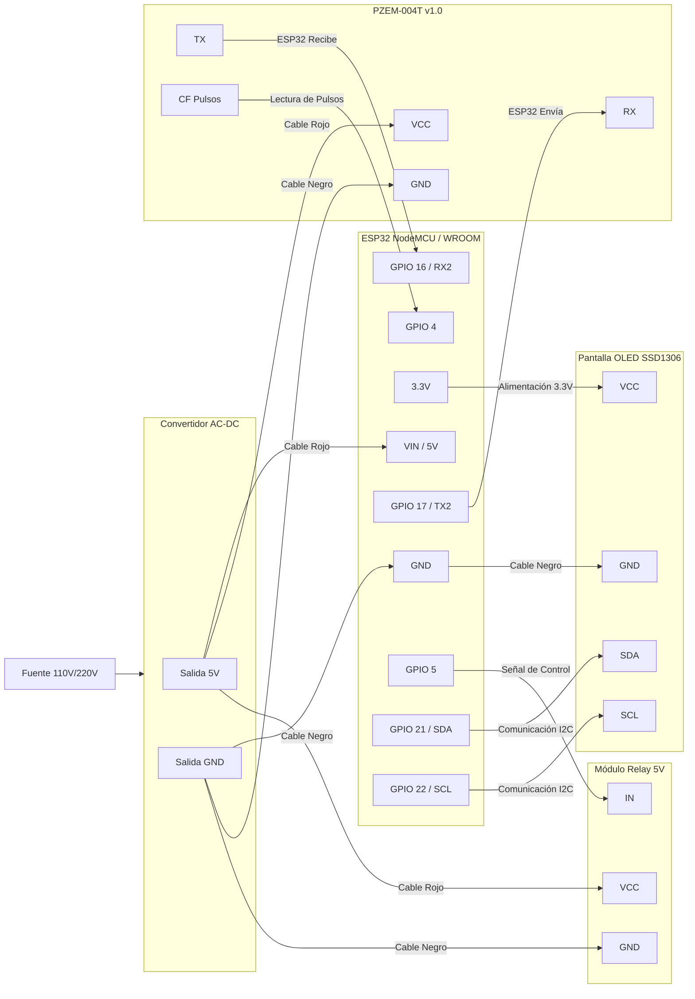

# Medidor de Energía Inteligente IoT

# Monitor de Energía Inteligente con ESP32

Este proyecto utiliza un ESP32 para leer datos de un sensor **PZEM-004T-100A-D-P (v1.0)**, mostrarlos en una pantalla OLED y enviarlos a un servidor Webhook. Además, controla/monitoriza el estado de un Relay.

## 📦 Materiales Requeridos
1. **ESP32** (NodeMCU-32S / WROOM-32)
2. **Sensor PZEM-004T-100A-D-P (v1.0)** — Nueva versión con pin CF de pulsos
3. **Pantalla OLED** (SSD1306 128x64 I2C)
4. **Relay 5V** (Para activar/desactivar la carga)
5. **Convertidor AC-DC 110V a 5V** (Fuente de alimentación)
6. **Bobina CT** (Sensor de corriente toroidal incluido con el PZEM)

## 🔌 Diagrama de Conexiones (Pinout)

### 1. Alimentación (Convertidor 110V a 5V)
Para que el ESP32 funcione con la energía de la casa, conecta la salida del convertidor así:
*   **Salida 5V (+)**  -> Pin **VIN** (o 5V) del ESP32.
*   **Salida GND (-)** -> Pin **GND** del ESP32.
*   *Nota: El puerto USB también entrega 5V, pero para instalación permanente usa el convertidor en VIN.*

### 2. Sensor PZEM-004T-100A-D-P (v1.0)
Este sensor usa comunicación UART (Modbus RTU a 9600 baud). Usamos `Serial2` del ESP32.

| Pin PZEM | Pin ESP32 | Color Cable | Descripción |
|----------|-----------|-------------|-------------|
| **VCC**  | **VIN (5V)** | Rojo | Alimentación 5V (obligatorio para UART) |
| **GND**  | **GND** | Negro | Tierra común |
| **RX**   | **GPIO 16** (TX2) | Piel | ESP32 transmite → PZEM recibe |
| **TX**   | **GPIO 17** (RX2) | Amarillo | PZEM transmite → ESP32 recibe |
| **CF**   | **GPIO 4** | Blanco | Salida de pulsos proporcional a potencia activa |

**Lado AC (Corriente Alterna):**
*   Conectar los terminales AC del PZEM a la red 110V/220V que deseas medir.
*   Pasar el cable de la carga (línea viva) a través del agujero de la bobina CT.
*   ⚠️ **PRECAUCIÓN:** Trabaja con seguridad al manipular corriente alterna.

**Sobre el pin CF:**
> El pin CF proporciona una señal de frecuencia proporcional a la potencia activa medida.
> Cada pulso representa una cantidad de energía consumida. El firmware usa una interrupción
> para contar estos pulsos y monitorear consumo en tiempo real.

### 3. Pantalla OLED (I2C)
| Pin OLED | Pin ESP32 | Color Cable |
|----------|-----------|-------------|
| **VCC**  | **3.3V**  | Rojo |
| **GND**  | **GND**   | Negro |
| **SCL**  | **GPIO 22** | Gris |
| **SDA**  | **GPIO 21** | Azul |

### 4. Módulo Relay 5V
| Pin Relay | Pin ESP32 | Color Cable |
|-----------|-----------|-------------|
| **VCC**   | **VIN (5V)** | Rojo |
| **GND**   | **GND** | Negro |
| **IN**    | **GPIO 5** | Blanco |

> **Nota:** El relay se movió a GPIO 5 para liberar GPIO 4 para el pin CF del PZEM.

## 📝 Resumen de Pines del ESP32

| GPIO | Función | Dispositivo |
|------|---------|-------------|
| 4    | CF (Pulsos) | PZEM-004T v1.0 |
| 5    | Relay IN | Módulo Relay |
| 16   | TX2 → RX PZEM | PZEM-004T v1.0 |
| 17   | RX2 ← TX PZEM | PZEM-004T v1.0 |
| 21   | SDA | OLED |
| 22   | SCL | OLED |

## 📚 Librerías Necesarias (Instalar en Arduino IDE)
Ve a *Programa > Incluir Librería > Administrar Bibliotecas* e instala:
1.  **PZEM004Tv30** por *Jakub Mandula* — Compatible con PZEM-004T v1.0
2.  **Adafruit SSD1306** por *Adafruit*
3.  **Adafruit GFX Library** por *Adafruit*

## ⚙️ Configuración
En el código (`arduino/Proyecto_Energia.ino`), cambia:
1.  `ssid` y `password` con los datos de tu WiFi.
2.  `webhookUrl` con la URL de tu Webhook (ej. Make, n8n, Google Apps Script).

## 🔄 Protocolo de Comunicación
El PZEM-004T v1.0 usa:
- **Interfaz:** UART TTL
- **Velocidad:** 9600 baud
- **Protocolo:** Modbus RTU
- **CRC:** CRC-16

La librería `PZEM004Tv30` maneja todo esto internamente. No es necesario construir tramas Modbus manualmente.

## 📊 Parámetros Medidos
| Parámetro | Rango | Resolución |
|-----------|-------|------------|
| Voltaje | 80 ~ 260V | 0.1V |
| Corriente | 0 ~ 100A | 0.001A |
| Potencia | 0 ~ 23kW | 0.1W |
| Energía | 0 ~ 9999.99kWh | 1Wh |
| Frecuencia | 45 ~ 65Hz | 0.1Hz |
| Factor de Potencia | 0.00 ~ 1.00 | 0.01 |
