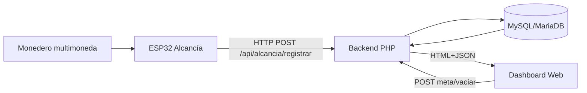

# Manual Técnico Completo - Proyecto Alcancía Inteligente IoT

## 1. Objetivo del sistema

Este proyecto integra:

1. Un módulo IoT de alcancía con ESP32 + monedero multimoneda + pantalla OLED + buzzer.
2. Un backend web en PHP (arquitectura MVC simple) para autenticación, visualización y control de la alcancía.
3. Una base de datos MySQL/MariaDB para persistencia de usuarios, metas, depósitos y retiros.
4. Un frontend web responsivo para operar todo desde navegador.

El objetivo funcional es que cualquier usuario autenticado pueda ver el estado de ahorro, registrar automáticamente los depósitos desde hardware, editar metas y retirar dinero con trazabilidad.

---

## 2. Arquitectura general

### 2.1 Capas del sistema

1. Capa física IoT: sensores/actuadores y microcontrolador.
2. Capa de transporte: WiFi + HTTP JSON.
3. Capa backend: enrutamiento, controladores, servicios, modelos y acceso DB.
4. Capa de persistencia: tablas SQL.
5. Capa de presentación: vistas PHP + CSS + JavaScript.

---

## 3. Estructura de carpetas y propósito

- src/public: punto de entrada web y recursos públicos.
- src/config: configuración de entorno, rutas y base de datos.
- src/app/Controllers: controladores HTTP.
- src/app/Services: lógica de aplicación reutilizable.
- src/app/Models: lógica y consultas de datos.
- src/app/Views: interfaces y plantillas HTML/PHP.
- database/produccion/structure.sql: esquema base de la base de datos.
- arduino/Proyecto_Alcancia.ino: firmware principal de la alcancía.
- docker-compose copy.yml + Dockerfile: despliegue en contenedores.

---

## 4. Componente IoT Alcancía (hardware)

## 4.1 Dispositivos

1. ESP32 (NodeMCU-32S o equivalente).
2. Monedero multimoneda CH-926/616.
3. Pantalla OLED SSD1306 I2C 128x64.
4. Buzzer.
5. Fuente adecuada para monedero (normalmente 12V).

## 4.2 Conexiones recomendadas (según firmware)

### ESP32 - Monedero

1. GND monedero -> GND ESP32 (tierra común obligatoria).
2. Señal de pulso monedero -> GPIO 4.
3. Pull-up de 10K entre GPIO 4 y 3.3V para limpiar ruido.
4. Si la señal del monedero supera 3.3V, usar divisor de voltaje.

### ESP32 - OLED

1. SDA -> GPIO 21.
2. SCL -> GPIO 22.
3. VCC -> 3.3V.
4. GND -> GND.

### ESP32 - Buzzer

1. Buzzer positivo -> GPIO 5.
2. Buzzer negativo -> GND.

## 4.3 Configuración del monedero

En el firmware se asume mapeo por pulsos:

1. 1 pulso = 100 COP.
2. 2 pulsos = 200 COP.
3. 5 pulsos = 500 COP.
4. 10 pulsos = 1000 COP.

Y timeout de detección aproximado para velocidad MEDIUM: 300 ms.

---

## 5. Firmware de Alcancía en Arduino IDE

Archivo: arduino/Proyecto_Alcancia.ino.

## 5.1 Librerías usadas

1. WiFi.h.
2. HTTPClient.h.
3. ArduinoJson.h.
4. Wire.h.
5. Adafruit_GFX.h.
6. Adafruit_SSD1306.h.

## 5.2 Flujo de ejecución

1. setup:
   - Inicializa pines, interrupción de monedas, OLED y buzzer.
   - Conecta a WiFi.
   - Sincroniza estado remoto llamando GET /api/alcancia/device-state.

2. Detección de moneda:
   - Cada pulso entra por interrupción en GPIO 4.
   - El loop espera silencio de pulsos por COIN_PULSE_TIMEOUT.
   - Clasifica la moneda según la tabla de pulsos.

3. Registro remoto:
   - Envía POST a /api/alcancia/registrar con monto y pulsos.
   - Si falla conexión, acumula en pendingSyncCoins para sincronizar luego.

4. Sincronización periódica:
   - Cada minuto consulta estado para alinear OLED con base de datos.

5. UI local:
   - OLED muestra total, meta, progreso, estado WiFi y pendientes.
   - Buzzer emite patrones distintos para éxito/error/meta alcanzada.

## 5.3 Endpoints consumidos por el firmware

1. POST /api/alcancia/registrar.
2. GET /api/alcancia/device-state.

---

## 6. Alcance del manual

Este manual está enfocado exclusivamente en el flujo funcional de la alcancía inteligente (hardware de monedas + backend web + dashboard). Cualquier módulo secundario no relacionado con ese flujo se considera fuera de alcance para esta documentación.

---

## 7. Backend Web PHP (cómo está programado)

## 7.1 Punto de entrada

1. src/public/index.php actúa como front controller.
2. Carga bootstrap, config y base de datos.
3. Resuelve ruta leyendo src/config/routes.php.
4. Instancia controlador y acción según URI.

## 7.2 Bootstrap y constantes

Archivo src/bootstrap.php:

1. Define BASE_PATH, BASE_URL, ASSETS_URL.
2. Diferencia entorno local vs Docker.
3. Carga helpers globales en src/functions.php.

## 7.3 Configuración de entorno

Archivo src/config/config.php:

1. Carga variables desde .env.
2. Define constantes de moneda.
3. Define configuración Soketi (host, puertos, app key/secret).

## 7.4 Conexión a base de datos

Archivo src/config/database.php:

1. Usa clase Database singleton con PDO.
2. Charset utf8mb4.
3. Modo excepciones para errores.
4. Zona horaria SQL ajustada a -05:00.

---

## 8. Lógica por capas en backend

## 8.1 Controladores clave

1. AuthController:
   - Login, registro y logout.
   - Manejo de sesión y redirecciones.

2. DashboardController:
   - Exige autenticación.
   - Obtiene estado de alcancía y carga dashboard.

3. AlcanciaApiController:
   - API JSON para depósitos, estado, edición de metas y vaciado.

4. PerfilController:
   - Actualización de perfil, foto y contraseña.

## 8.2 Servicio de autenticación

Archivo src/app/Services/AuthService.php:

1. Login y registro.
2. Construcción de sesión de usuario.
3. Validación de acceso (requireLogin).
4. Actualización de metadatos de acceso e IP.

## 8.3 Modelo principal de negocio

Archivo src/app/Models/Alcancia.php:

1. ensureTables crea tablas de alcancía si no existen.
2. registrarDeposito:
   - Inserta depósito.
   - Incrementa total_ahorrado.
   - Distribuye monto a metas activas por prioridad.
   - Todo en transacción.

3. getEstado:
   - Devuelve snapshot completo: config, metas, últimos depósitos, retiros y resumen.

4. actualizarMeta:
   - Valida límites y coherencia del objetivo.
   - Actualiza meta y meta_general.

5. retirarDinero:
   - Inserta retiro.
   - Descuenta del total.
   - Ajusta avance de metas.
   - Si vacía todo, reinicia monto_actual de metas.

6. getEstadoDispositivo:
   - Devuelve un estado simplificado para OLED/ESP32.

---

## 9. API de la alcancía

Rutas definidas en src/config/routes.php.

## 9.1 Endpoints operativos

1. POST /api/alcancia/registrar
   - Registra depósito desde ESP32 o cliente.
2. GET /api/alcancia/status
   - Estado consolidado para dashboard.
3. GET /api/alcancia/device-state
   - Estado simplificado para dispositivo.
4. GET /api/alcancia/stream
   - Stream SSE con snapshots periódicos.
5. POST /api/alcancia/meta/actualizar
   - Edita meta y monto objetivo.
6. POST /api/alcancia/vaciar
   - Retiro parcial o total.
7. POST /api/alcancia/comando
   - Procesa comando lógico para sincronización.

## 9.2 Seguridad

1. Varias operaciones exigen sesión activa (AuthService::isLoggedIn).
2. Validación de método HTTP y JSON en controlador.
3. Manejo de errores controlado con respuestas JSON + códigos HTTP.

---

## 10. Frontend web (cómo está programada la página)

## 10.1 Base visual

1. Plantillas en PHP dentro de src/app/Views.
2. CSS principal en src/public/assets/css/app.css.
3. JS global en src/public/assets/js/app.js.
4. Uso de Bootstrap vía CDN.
5. Uso de Bootstrap Icons y FontAwesome.
6. Tipografías desde Google Fonts (Inter y Outfit en layout principal).

## 10.2 Dashboard de alcancía

Archivo principal: src/app/Views/dashboard.php.

Incluye:

1. Tarjetas de métricas (total, meta, depósitos).
2. Barras de progreso.
3. Tabla de depósitos.
4. Tabla de retiros.
5. Formularios para editar metas.
6. Botones para retirar dinero y limpieza de registros.

## 10.3 Lógica JavaScript del dashboard

1. renderEstado:
   - Toma payload API y vuelve a dibujar UI.
2. bindMetaForms:
   - Envía cambios de metas vía fetch POST JSON.
3. bindVaciarButton:
   - Solicita monto/motivo y envía a /api/alcancia/vaciar.
4. startAutoRefresh:
   - Polling cada 2 segundos a /api/alcancia/status?limit=10.

Nota importante:

Existe en la vista una llamada a /api/alcancia/eliminar-registros, pero esa ruta no está definida actualmente en src/config/routes.php.

---

## 11. Base de datos y lógica de datos

Archivo base: database/produccion/structure.sql.

## 11.1 Tablas principales

1. usuarios.
2. alcancia_config.
3. alcancia_metas.
4. alcancia_depositos.
5. alcancia_retiros.

## 11.2 Semillas iniciales

1. Registro de alcancía principal (id=1).
2. Usuario administrador precargado.
3. Meta General inicial.

## 11.3 Comportamiento esperado

1. Cada depósito incrementa total_ahorrado.
2. El avance de metas se reparte por prioridad.
3. Cada retiro deja traza en alcancia_retiros.
4. El estado del dashboard siempre se reconstruye desde base de datos.

---

## 12. Instalación y ejecución en entorno local (XAMPP)

## 12.1 Requisitos

1. PHP 8+.
2. MariaDB/MySQL.
3. Apache (XAMPP).
4. Arduino IDE (para firmware).

## 12.2 Pasos recomendados

1. Colocar el proyecto en htdocs.
2. Crear/importar base de datos:
   - Importar database/produccion/structure.sql.
3. Configurar .env con host, puerto, base, usuario y clave.
4. Verificar DocumentRoot hacia src/public o acceder por ruta equivalente.
5. Entrar a /login y autenticar.
6. Abrir dashboard y validar respuesta de /api/alcancia/status.

---

## 13. Ejecución con Docker

## 13.1 Componentes

1. Servicio app (PHP + Apache).
2. Servicio soketi (websocket/Pusher-compatible).
3. Volúmenes para uploads.

## 13.2 Archivos usados

1. Dockerfile:
   - Base php:8.1-apache.
   - Instala pdo y pdo_mysql.
   - Habilita rewrite.
2. docker/apache/000-default.conf:
   - DocumentRoot en /var/www/html/src/public.
3. docker-compose copy.yml:
   - Variables de entorno DB y Soketi.

---

## 14. Librerías y dependencias por capa

## 14.1 Firmware Arduino

1. WiFi.
2. HTTPClient.
3. ArduinoJson.
4. Adafruit_GFX.
5. Adafruit_SSD1306.

## 14.2 Backend PHP

1. PDO (extensión nativa).
2. Funciones nativas PHP para sesiones y JSON.
3. Implementación de firma HMAC para Soketi (sin SDK externo obligatorio).

## 14.3 Frontend

1. Bootstrap 5.
2. Bootstrap Icons.
3. FontAwesome.
4. Chart.js (incluido en footer global).
5. JS personalizado en app.js y scripts inline de vistas.

---

## 15. Flujo completo de negocio (de extremo a extremo)

1. Usuario introduce moneda en monedero.
2. Monedero emite N pulsos.
3. ESP32 cuenta pulsos por interrupción y traduce a monto.
4. ESP32 envía POST JSON al backend.
5. Backend valida y persiste depósito en DB.
6. Modelo actualiza total y metas en transacción.
7. Dashboard, por polling, consulta estado cada 2 s.
8. Usuario ve actualización casi en tiempo real.
9. Usuario puede editar meta o retirar dinero.
10. Backend recalcula consistencia y devuelve nuevo estado.
11. ESP32 sincroniza periódicamente estado para OLED.

---

## 16. Guía para replicar el proyecto desde cero

## 16.1 Parte web

1. Instalar XAMPP o stack equivalente.
2. Clonar/copiar proyecto.
3. Crear base de datos importando structure.sql.
4. Configurar variables en .env.
5. Levantar Apache y MySQL.
6. Probar login y dashboard.

## 16.2 Parte IoT (alcancía)

1. Instalar Arduino IDE.
2. Instalar soporte de placa ESP32.
3. Instalar librerías listadas en sección 5.1.
4. Abrir arduino/Proyecto_Alcancia.ino.
5. Configurar ssid, password y URLs API.
6. Cargar firmware al ESP32.
7. Verificar monitor serial y OLED.
8. Insertar moneda y comprobar aparición en dashboard.

## 17. Pruebas mínimas recomendadas

1. Login correcto e incorrecto.
2. Registro de usuario nuevo.
3. Inserción de monedas de cada denominación configurada.
4. Edición de meta con valores válidos e inválidos.
5. Retiro parcial y retiro total.
6. Comportamiento sin WiFi en ESP32 (cola de pendientes).
7. Recuperación de sincronización cuando vuelve internet.

---

## 18. Problemas comunes y solución

1. No aparecen depósitos en dashboard:
   - Validar URL API en firmware.
   - Verificar logs de Apache/PHP.
   - Comprobar que /api/alcancia/registrar responde 201.

2. Pulsos erráticos del monedero:
   - Confirmar GND común.
   - Confirmar resistencia pull-up de 10K.
   - Revisar nivel de voltaje de señal.
   - Ajustar COIN_PULSE_TIMEOUT y DEBOUNCE_TIME.

3. Ruta base rota en local:
   - Revisar resolución BASE_URL y SCRIPT_NAME en bootstrap.

4. Error de DB:
   - Validar credenciales en .env.
   - Comprobar existencia de tablas en energia_db.

5. Endpoint inexistente en UI:
   - Revisar llamadas fetch en dashboard vs rutas reales definidas.

---

## 19. Recomendaciones de mejora

1. Mover scripts inline de dashboard a archivos JS dedicados.
2. Centralizar y documentar rutas legacy para evitar endpoints huérfanos.
3. Implementar endpoint faltante para eliminar registros o quitar botón.
4. Agregar autenticación por token para endpoint de depósito del ESP32.
5. Añadir pruebas automáticas para modelo Alcancia y AuthService.
6. Versionar un .env.example sin secretos.

---

## 20. Resumen final

El sistema está compuesto por un núcleo IoT de captura de monedas y un backend web MVC en PHP que administra autenticación, metas, depósitos y retiros en base de datos, mostrando resultados en un dashboard responsivo con actualización periódica. Con este manual, cualquier persona puede reconstruir tanto la parte electrónica (Arduino IDE + ESP32 + conexiones) como la parte web (XAMPP/Docker + SQL + rutas + lógica de negocio) y entender por qué existe cada componente y cómo se relaciona dentro del flujo completo.